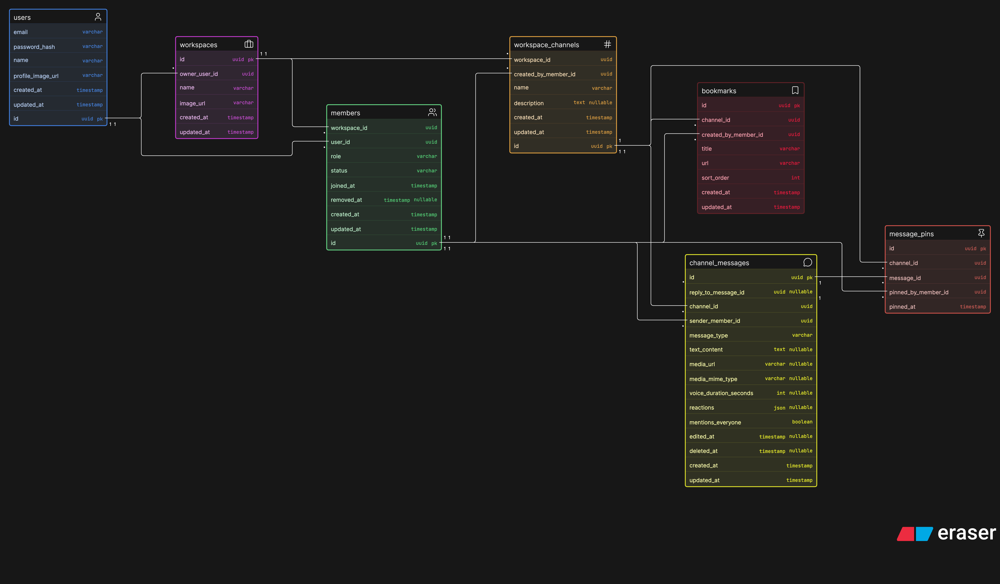

# Workspace Chat App (Chatty)

## Overview
Chatty is a workspace-based communication platform where users can create workspaces, invite members, organize conversations into channels, and exchange text, image, and voice messages. It also supports replies, reactions, pinned messages, bookmarks, member management, and @everyone email notifications.

### Technologies Used
- Express.js
- React
- MongoDB
- Shadcn
- React Hook Form
- Socket.io
- Tailwind CSS
- Cloudflare R2

## User Stories

## CREATE

---

- As a user, I want to create multiple workspaces so that I can organize different teams and projects separately.

- As a workspace owner, I want to create channels inside my workspace so that members can organize conversations by topic.

- As a workspace owner, I want to invite other people to my workspace so that they can join and collaborate with its members.

- As a user, I want to send text messages in a channel so that I can communicate with other workspace members.

- As a user, I want to send images in a channel so that I can share visual content with other workspace members.

- As a user, I want to send voice notes in a channel so that I can communicate without typing a message.

- As a user, I want to react to my messages and other members' messages so that I can respond quickly without sending a new message.

- As a user, I want to pin my messages or other members' messages so that important information remains easy to find.

- As a user, I want to create bookmarks inside a channel so that useful links and resources are easy to access.

- As a user, I want to reply to other members' messages so that conversations remain organized and contextual.

- As a user, I want to mention `@everyone` in a message so that all workspace members receive an email notification about important information.

## READ

---

- As a user, I want to see all members inside a workspace so that I know who belongs to the workspace.

## UPDATE

---

- As a user, I want to edit my messages so that I can correct mistakes or update the information I shared.

- As a workspace owner, I want to change the workspace name so that it continues to represent the team or project accurately.

- As a workspace owner, I want to change the workspace image so that members can identify the workspace easily.

- As a user, I want to change my name so that my profile displays the correct information.

- As a user, I want to change my profile image so that other workspace members can identify me easily.

## DELETE

---

- As a user, I want to delete my messages so that I can remove content that is incorrect or no longer needed.

- As a workspace owner, I want to remove a member from the workspace so that I can control who has access to it.

## Database Design

## Routes

### Users and Authentication

| Method | Route | Description |
|---|---|---|
| POST | `/auth/sign-up` | Create a user account |
| POST | `/auth/sign-in` | Authenticate user and create session |
| POST | `/auth/sign-out` | End the current session |
| GET | `/users/me` | Get the authenticated user's profile |
| PATCH | `/users/me` | Update the authenticated user's name or profile image |
| DELETE | `/users/me` | Delete the authenticated user's account |

### Workspaces

| Method | Route | Description |
|---|---|---|
| GET | `/workspaces` | List workspaces belonging to the authenticated user |
| POST | `/workspaces` | Create a workspace |
| GET | `/workspaces/:workspaceId` | Get workspace details |
| PATCH | `/workspaces/:workspaceId` | Update workspace name or image (owner/admin) |
| DELETE | `/workspaces/:workspaceId` | Delete a workspace (owner only) |

### Members

| Method | Route | Description |
|---|---|---|
| GET | `/workspaces/:workspaceId/members` | List all active workspace members |
| GET | `/workspaces/:workspaceId/members/:memberId` | Get a workspace member |
| PATCH | `/workspaces/:workspaceId/members/:memberId` | Change a member's role (owner/admin) |
| DELETE | `/workspaces/:workspaceId/members/:memberId` | Remove a member from the workspace (owner/admin) |
| POST | `/workspaces/:workspaceId/leave` | Leave the workspace |

### Workspace Invites

| Method | Route | Description |
|---|---|---|
| GET | `/workspaces/:workspaceId/invites` | List pending workspace invitations (owner/admin) |
| POST | `/workspaces/:workspaceId/invites` | Invite a user by email (owner/admin) |
| GET | `/invites/:inviteCode` | Validate an invitation code |
| POST | `/invites/:inviteCode/accept` | Accept an invitation and create a membership |
| POST | `/invites/:inviteCode/decline` | Decline an invitation |
| POST | `/workspaces/:workspaceId/invites/:inviteId/resend` | Generate and send a new invitation code |
| DELETE | `/workspaces/:workspaceId/invites/:inviteId` | Revoke a pending invitation (owner/admin) |

### Workspace Channels

| Method | Route | Description |
|---|---|---|
| GET | `/workspaces/:workspaceId/channels` | List channels inside a workspace |
| POST | `/workspaces/:workspaceId/channels` | Create a workspace channel (owner/admin) |
| GET | `/workspaces/:workspaceId/channels/:channelId` | Get channel details |
| PATCH | `/workspaces/:workspaceId/channels/:channelId` | Update channel name or description (owner/admin) |
| DELETE | `/workspaces/:workspaceId/channels/:channelId` | Delete a channel (owner/admin) |

### Channel Messages

| Method | Route | Description |
|---|---|---|
| GET | `/channels/:channelId/messages` | List channel messages with pagination |
| POST | `/channels/:channelId/messages` | Send a text, image, or voice message |
| GET | `/channels/:channelId/messages/:messageId` | Get a single message |
| PATCH | `/channels/:channelId/messages/:messageId` | Edit the authenticated user's message |
| DELETE | `/channels/:channelId/messages/:messageId` | Soft-delete the authenticated user's message |
| POST | `/channels/:channelId/messages/:messageId/replies` | Reply to a message |
| POST | `/channels/:channelId/messages/:messageId/reactions` | Add or update the authenticated user's reaction |
| DELETE | `/channels/:channelId/messages/:messageId/reactions/:reaction` | Remove the authenticated user's reaction |

## Future Enhancements